# lottery
**lottery** is a blockchain built using Cosmos SDK and Tendermint and created with [Ignite CLI](https://ignite.com/cli).

In the **.docs/adr** you can find all descriptive information for architecture decisions.

This readme file contain two DEMO examples one for happy path and one for edge cases that the lottery
handler. For the DEMO is used a small cmd program placed in .cmd/demo/main.go. Also the folder
.cmd/demo/ contains files with the results of the local execution of the DEMO.

At the end of this file you can see the answers of the bonus strategies questions.

What is not implement. Block on every 5 minutes is not implemented. You can find why in ADR-10.

### Rules of the lottery

Anyone can enter the lottery as long as they have enough funds.
A winner is chosen at the end of a block if the lottery has 10 or more valid lottery
transactions. If there weren’t enough transactions, the lottery continues. Once a winner is chosen, a payout is sent and the next lottery cycle begins

## Get started

First you should have Ignite CLI installed on you computer. This application is build with version v0.25.2. To install it at the command line

```
curl https://get.ignite.com/cli@v0.25.2! | bash
```
You can verify the version of Ignite CLI you have once it is installed:

```
ignite version
```

This prints its version:

```
Ignite CLI version:	v0.25.2
...
```

When you are at lottery folder run this command to start the chain 

```
ignite chain serve
```

The command compiles the source code into a binary called **lotteryd**. It installs dependencies, builds, initializes the node with a single validator, add accounts, and starts your blockchain in development.

### Configure

Your blockchain in development can be configured with `config.yml`. To learn more, see the [Ignite CLI docs](https://docs.ignite.com).

## DEMO

In the previous steps we started the application now we can interact with it through sending queries and transactions.
The project contains a simple client application that sends 20 entered lottery transaction from 20 different clients, 
with 20 different bets. For example *client1: 1token*, *client2: 2token*, *client3: 3token*, ... and so on. These 20 
transactions are repeat 100 times or until the clients run out of funds.  Run the command below to execute the client:

```
go run ./cmd/demo/main.go
```

This program can take several minutes. After it finished we can see the results (**N0TE we will execute a large number 
with commands, your result from the commands will be different from main.**). 

#### List all finished lotteries

We can list all finished lotteries by command:

```
lotteryd query lottery list-finished-lottery --limit 200
```

The result is:

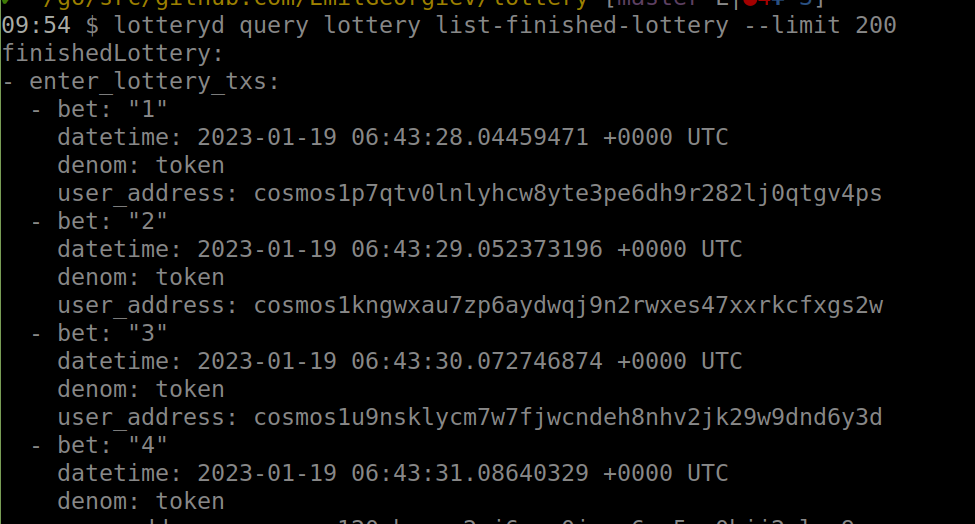

The output is too big, you can an example of the result in the file .cmd/demo/list-finished-lotteries.
**NOTE** the file contains just an example. The data in the file is not from your execution of the program.


#### Get the system info

We can get the current system info, by  using the command:

```
lotteryd query lottery show-system-info
```

The result is:

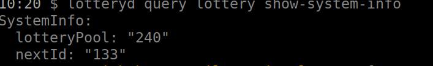

As we can see in the lottery pool we have **240token** that will be paid as reward to next winner which placed the heights bet.
The system-info show and what will be nextID of the next finished lottery.

#### Get all balances of the clients

First we should export addresses of the clients in variables:

```
export client1=$(lotteryd keys show client1 -a) 
export client2=$(lotteryd keys show client2 -a)
export client3=$(lotteryd keys show client3 -a)
export client4=$(lotteryd keys show client4 -a)
export client5=$(lotteryd keys show client5 -a)
export client6=$(lotteryd keys show client6 -a)
export client7=$(lotteryd keys show client7 -a)
export client8=$(lotteryd keys show client8 -a)
export client9=$(lotteryd keys show client9 -a)
export client10=$(lotteryd keys show client10 -a)
export client11=$(lotteryd keys show client11 -a)
export client12=$(lotteryd keys show client12 -a)
export client13=$(lotteryd keys show client13 -a)
export client14=$(lotteryd keys show client14 -a)
export client15=$(lotteryd keys show client15 -a)
export client16=$(lotteryd keys show client16 -a)
export client17=$(lotteryd keys show client17 -a)
export client18=$(lotteryd keys show client18 -a)
export client19=$(lotteryd keys show client19 -a)
export client20=$(lotteryd keys show client20 -a)
```

Then we can use these exported variable to get the balances:

```
lotteryd query bank balances $client1
lotteryd query bank balances $client2
lotteryd query bank balances $client3
lotteryd query bank balances $client4
lotteryd query bank balances $client5
lotteryd query bank balances $client6
lotteryd query bank balances $client7
lotteryd query bank balances $client8
lotteryd query bank balances $client9
lotteryd query bank balances $client10
lotteryd query bank balances $client11
lotteryd query bank balances $client12
lotteryd query bank balances $client13
lotteryd query bank balances $client14
lotteryd query bank balances $client15
lotteryd query bank balances $client16
lotteryd query bank balances $client17
lotteryd query bank balances $client18
lotteryd query bank balances $client19
lotteryd query bank balances $client20
```

An example of the result  for the client2 is:

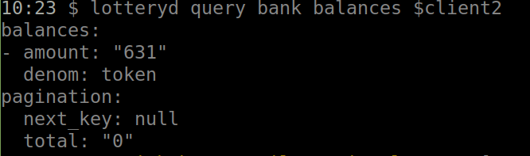

In the file ./cmd/demo/balances you can all balances. 
**NOTE** the file contains an example. This is not your data:

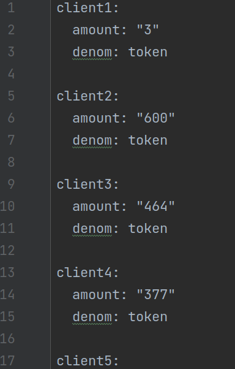


#### Get the current lottery:

We can see the current lottery:

```
lotteryd query lottery show-lottery
```

The result is:

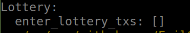

As we can see the current lottery has zero transactions.


#### How can we be sure that the lottery works correctly

Let's check whether lottery working correctly. For example, we will use the client2 and will follow all his bets 
and rewards, we will calculate his balance and we will see whether our result mach the with the actual balance.  

 - First we will get his address

```
lotteryd keys show client2 -a
```

The result is:

```
cosmos1kngwxau7zp6aydwqj9n2rwxes47xxrkcfxgs2w
```

 - calculate all the payments that the client2 was made. We know that the client2 always place the bet with **2token**, 
also we know that he must pay fee of **5token** per transaction. If we know the number of all lotteries in which the 
client2 placed a valid bet, we can calculate the total payments. Let's get that number by using this command:

```
lotteryd query lottery list-finished-lottery --limit 200 | grep -c "user_address: cosmos1kngwxau7zp6aydwqj9n2rwxes47xxrkcfxgs2w"
``` 

The result is:

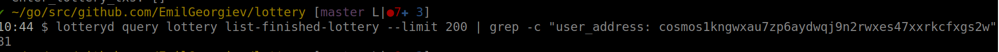

The user placed  **81** valid bets. This means that he paid 5token fee + 2token, total 7token per bet. The total tokens 
that he paid are **81x7 = 567**

 - check how many times the client2 won the lottery. We can see the result by using the command:

```
lotteryd query lottery list-finished-lottery --limit 200 | grep -B 2 -A 1 "winner: cosmos1kngwxau7zp6aydwqj9n2rwxes47xxrkcfxgs2w"
```

The result is:

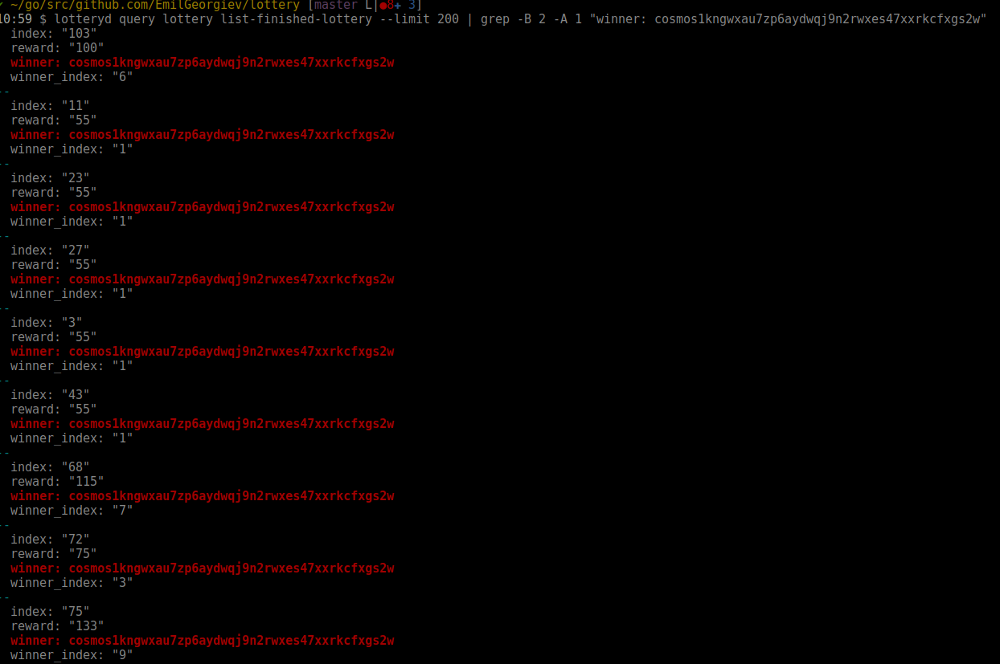

The client2 won 9 times the lottery. Also, from the picture we can see how much rewards he got for every lottery. 
(100+55+55+55+55+55+115+75+133= 698). If we take ot the payments from the rewards 698-567 = 131 is the profit. 
If we add the profit to the initial balance (500token) we will get that
thr balance of the client2 should be **631token** we can confirm that:

 - Confirm that the balance of the client is **631token**.  

```
lotteryd query bank balances cosmos1kngwxau7zp6aydwqj9n2rwxes47xxrkcfxgs2w
```

The result is:

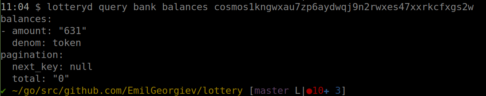

As we can see the balance is 631token, as we expected. 

## DEMO edge cases

In this demo we will test some edge cases

### User can't place a bet without exactly 5 fees.

 - User can't place a bet without any fees:

```
lotteryd tx lottery enter-lottery 1 token --from cosmos1kngwxau7zp6aydwqj9n2rwxes47xxrkcfxgs2w -y
```

The result is:

```
raw_log: 'Tx must contains exactly 5 fee: insufficient fee'
```

 - User can't place a bet with the lowest fees then 5

```
lotteryd tx lottery enter-lottery 1 token --from cosmos1kngwxau7zp6aydwqj9n2rwxes47xxrkcfxgs2w --fees 4token -y
```

The result is:

```
raw_log: 'Tx must contains exactly 5 fee: insufficient fee'
```

 - User can't place a bet with higher fees then 5

```
lotteryd tx lottery enter-lottery 1 token --from cosmos1kngwxau7zp6aydwqj9n2rwxes47xxrkcfxgs2w --fees 6token -y
```

The result is:

```
raw_log: 'Tx must contains exactly 5 fee: insufficient fee'
```

### The bet of the user should be between 1-100

 - Place bet higher then 100

```
lotteryd tx lottery enter-lottery 101 token --from cosmos1wkx4pmsmy0hkc9xurhz4mxfwulwfh7rkl2ces9 --fees 5token -y
```

Then we can see that the current lottery is empty. The bet is not placed:

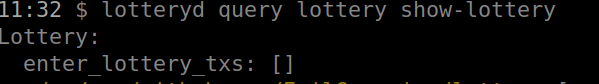


### The lottery won't fire if there are leas then 10 users

 - place 9  bets from 9 different clients. **NOTE** you should have addresses of the clients exported in variables. 
We did that already

```
lotteryd tx lottery enter-lottery 1 token --from client1 --fees 5token -y
lotteryd tx lottery enter-lottery 2 token --from client2 --fees 5token -y
lotteryd tx lottery enter-lottery 3 token --from client3 --fees 5token -y
lotteryd tx lottery enter-lottery 4 token --from client4 --fees 5token -y
lotteryd tx lottery enter-lottery 5 token --from client5 --fees 5token -y
lotteryd tx lottery enter-lottery 6 token --from client6 --fees 5token -y
lotteryd tx lottery enter-lottery 7 token --from client7 --fees 5token -y
lotteryd tx lottery enter-lottery 8 token --from client8 --fees 5token -y
lotteryd tx lottery enter-lottery 9 token --from client9 --fees 5token -y
```

Then we can see the lottery:

```
lotteryd query lottery show-lottery
```

The result is

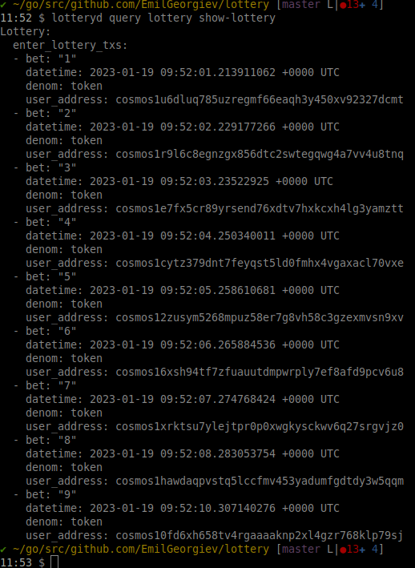


There are 9 transactions in the lottery and the lottery will not fire. We can list the finished lotteries:

```
lotteryd query lottery list-finished-lottery
```

the result is

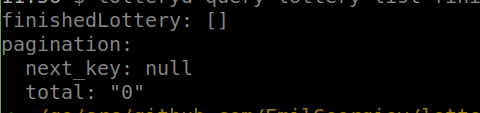    

as we can see the list is empty. But if we place one more bet:

```
lotteryd tx lottery enter-lottery 10 token --from client10 --fees 5token -y
```

Then the current lottery is:

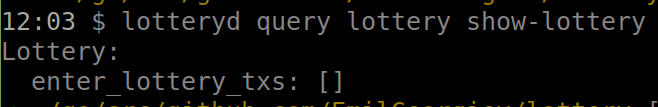


And the finished lotteries are

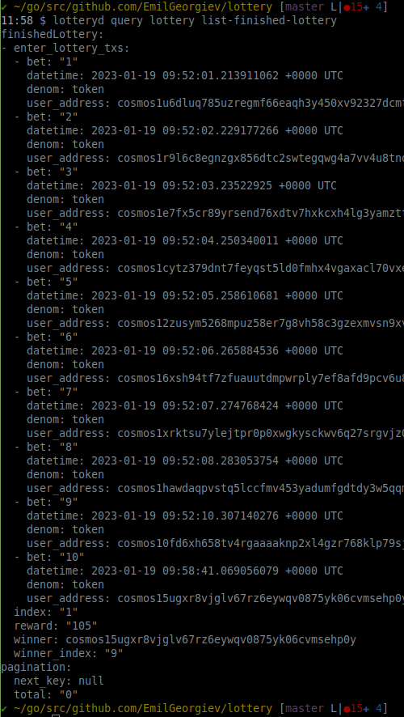

The system-info is:

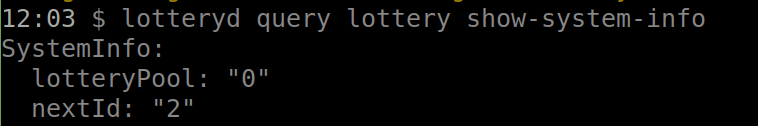


## Bonus strategy

### 1. Assuming uniform random bet from all other clients, what is the best strategy for client1?
    
The best strategy for client1 is to place a bigger bet than all other clients. If he doesn't know what is the 
uniform bet from all other clients, he should place the maximum allowed bet (100). By doing that he will be the only 
one that can win money from the lottery because all other clients placed the lowest bet (except if all other clients 
also placed a bet of 100) and the lottery will never pay a reward to them. When client1 wins the lottery he will get 
the whole lottery pool from the current and previous lotteries. Also, it is important the client has a big balance to 
avoid cases in which he is out of money. 

Let's test the strategy. Run the application with 10 clients with a balance of 50000 tokens. Everyone participates 
in the 100 lotteries. The result is: client1 has 90109tokens in the balance.  

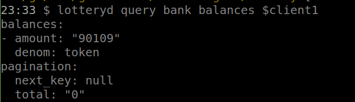

The all other clients have 44701.

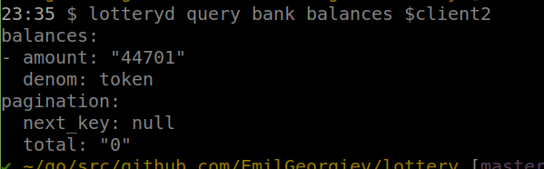

We confirm that this the best strategy for the client 1 


### 2. Assuming uniform random bet from all other clients, and client1 behaves in the strategy mentioned (1.), what is the best strategy for client2?

Let's test the strategy and see the result. Let's say that we have 10 clients with 50000token balance, the clients 
one and two place the highest bet (100), and all other clients place random bet. After the test finished we see that 
the first two players have bigger balances:
 
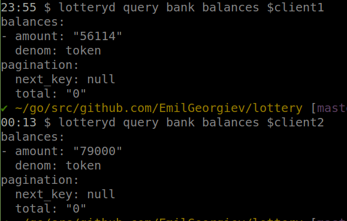

All other players suffer a loss. They have 44701token in their balances: 

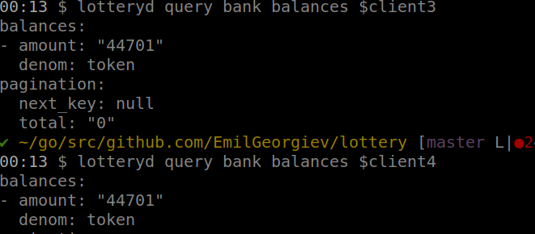

### 3. What is the Nash equilibrium?

We have Nash equilibrium when all players placed the highest bet (100). This is also **strict** Nash equilibrium because 
every one player will suffer a loss by changing his strategy.  


### Install
To install the latest version of your blockchain node's binary, execute the following command on your machine:

```
curl https://get.ignite.com/EmilGeorgiev/lottery@latest! | sudo bash
```
`EmilGeorgiev/lottery` should match the `username` and `repo_name` of the Github repository to which the source code was pushed. Learn more about [the install process](https://github.com/allinbits/starport-installer).

## Learn more

- [Ignite CLI](https://ignite.com/cli)
- [Tutorials](https://docs.ignite.com/guide)
- [Ignite CLI docs](https://docs.ignite.com)
- [Cosmos SDK docs](https://docs.cosmos.network)
- [Developer Chat](https://discord.gg/ignite)
